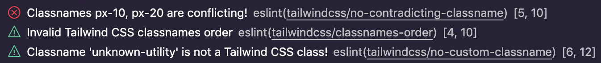

# eslint-plugin-tailwindcss

  


Rules enforcing best practices and consistency using [Tailwind CSS](https://tailwindcss.com/).

While you can use the official plugin [`prettier-plugin-tailwindcss`](https://www.npmjs.com/package/prettier-plugin-tailwindcss) for ordering your classnames...

**`eslint-plugin-tailwindcss` offers more than 5 other rules, that you can benefit from on top of `prettier-plugin-tailwindcss`. Sounds good ? Keep reading 👇**

## Supported Rules

Learn more about each supported rules by reading their documentation:

- [`classnames-order`](docs/rules/classnames-order.md): order classnames for consistency and it makes merge conflict a bit easier to resolve
- [`enforces-negative-arbitrary-values`](docs/rules/enforces-negative-arbitrary-values.md): make sure to use negative arbitrary values classname without the negative classname e.g. `-top-[5px]` should become `top-[-5px]`
- [`enforces-shorthand`](docs/rules/enforces-shorthand.md): merge multiple classnames into shorthand if possible e.g. `mx-5 my-5` should become `m-5`
- [`migration-from-tailwind-2`](docs/rules/migration-from-tailwind-2.md) for easy upgrade from Tailwind CSS `v2` to `v3`.
  Warning: at the moment you should [temporary turn off the `no-custom-classname`](https://github.com/francoismassart/eslint-plugin-tailwindcss/issues/88) rule if you want to see the warning from `migration-from-tailwind-2`
- [`no-arbitrary-value`](docs/rules/no-arbitrary-value.md): forbid using arbitrary values in classnames (turned off by default)
- [`no-custom-classname`](docs/rules/no-custom-classname.md): only allow classnames from Tailwind CSS and the values from the `whitelist` option
- [`no-contradicting-classname`](docs/rules/no-contradicting-classname.md): e.g. avoid `p-2 p-3`, different Tailwind CSS classnames (`pt-2` & `pt-3`) but targeting the same property several times for the same variant.
- [`no-unnecessary-arbitrary-value`](docs/rules/no-unnecessary-arbitrary-value.md): e.g. replacing `m-[1.25rem]` by its configuration based classname `m-5`

Using ESLint extension for Visual Studio Code, you will get these messages


You can can the same information on your favorite command line software as well.

## 🤝 Support `eslint-plugin-tailwindcss`

| 🥰 How you can support us?                                                                                                                                                                                                            | 💪 They did it!                                                                                                                                                                                                                                                                                                                                                                                                                                                                                                                                                                                                                                                                                                                                                                                                                                                                                                                                                                                                                                                                                                                                                                                                                                                                                                                                                                                                                                                                                                                                                                                                                                                                                                                                                                                                                                                                                                                |
| ------------------------------------------------------------------------------------------------------------------------------------------------------------------------------------------------------------------------------------- | ------------------------------------------------------------------------------------------------------------------------------------------------------------------------------------------------------------------------------------------------------------------------------------------------------------------------------------------------------------------------------------------------------------------------------------------------------------------------------------------------------------------------------------------------------------------------------------------------------------------------------------------------------------------------------------------------------------------------------------------------------------------------------------------------------------------------------------------------------------------------------------------------------------------------------------------------------------------------------------------------------------------------------------------------------------------------------------------------------------------------------------------------------------------------------------------------------------------------------------------------------------------------------------------------------------------------------------------------------------------------------------------------------------------------------------------------------------------------------------------------------------------------------------------------------------------------------------------------------------------------------------------------------------------------------------------------------------------------------------------------------------------------------------------------------------------------------------------------------------------------------------------------------------------------------ |
| **Premium Sponsors** <br /> Support us by becoming a sponsor. <br /> [Become a recurring sponsor](https://github.com/sponsors/francoismassart?frequency=recurring)                                                                    | <a href="https://daily.dev/" target="_blank"></a>                                                                                                                                                                                                                                                                                                                                                                                                                                                                                                                                                                                                                                                                                                                                                                                                                                                                                                                                                                                                                                                                                                                                                                                                                                                                                                                                                                                                                                                                                                                                                                                                                                                                                                                                             |
| **Current Sponsors** <br /> Any amount is appreciated.                                                                                                                                                                                | <a href="https://github.com/kylemh" target="_blank"></a> <a href="https://github.com/jonz94" target="_blank"></a> <a href="https://github.com/theMosaad" target="_blank"></a> <a href="https://github.com/acewf" target="_blank"></a> <a href="https://github.com/charkour" target="_blank"></a> <a href="https://github.com/dailydotdev" target="_blank"></a> <a href="https://github.com/codecov" target="_blank"></a> <a href="https://github.com/sourcegraph" target="_blank"></a> <a href="https://github.com/getsentry" target="_blank"></a> |
| **Past sponsors** <br /> Even if this is just a one-time thing. <br /> [Become a backer](https://github.com/sponsors/francoismassart?frequency=one-time)                                                                              | <a href="https://github.com/aniravi24" target="_blank"></a> <a href="https://github.com/mongolyy" target="_blank"></a> <a href="https://github.com/t3dotgg" target="_blank"></a> <a href="https://github.com/fongandrew" target="_blank"></a> <a href="https://github.com/nivalis-studio" target="_blank"></a>                                                                                                                                                                                                                                                                                                                                                                                                                                                                                                                                                                                                                                                                                                                                                                                                                                                                           |
| **Contributors** <br /> This project can evolve thanks to all the people who contribute. <br /> You are welcome to [contribute](CONTRIBUTING.md) to this project by reporting issues, feature requests or even opening Pull Requests. | <a href="https://github.com/francoismassart/eslint-plugin-tailwindcss/graphs/contributors"></a>                                                                                                                                                                                                                                                                                                                                                                                                                                                                                                                                                                                                                                                                                                                                                                                                                                                                                                                                                                                                                                                                                                                                                                                                                                                                                                                                                                                                                                                                                                                                                                                                                                                                                                                    |
| **Supporters** <br /> Talk about the plugin on your social networks                                                                                                                                                                   | [Share the word on Bluesky](https://bsky.app/search?q=eslint-plugin-tailwindcss) or [Reach my profile](https://bsky.app/profile/francoismassart.be)                                                                                                                                                                                                                                                                                                                                                                                                                                                                                                                                                                                                                                                                                                                                                                                                                                                                                                                                                                                                                                                                                                                                                                                                                                                                                                                                                                                                                                                                                                                                                                                                                                                                                                                                                                            |

## Latest changelog

- feat: [`enforces-shorthand` rule now support `place-content-*`/`place-items-*`/`place-self-*`](https://github.com/francoismassart/eslint-plugin-tailwindcss/issues/376)
- fix: [`enforces-shorthand` does not work for `h-` & `w-` when prefixed](https://github.com/francoismassart/eslint-plugin-tailwindcss/issues/378) (by [Kamahl19](https://github.com/Kamahl19) 🙏)
- docs: so long X
- fix: [custom classnames rule with VueJS objects within list](https://github.com/francoismassart/eslint-plugin-tailwindcss/pull/359) (by [Ericlm](https://github.com/Ericlm) 🙏)
- fix: config loading cache
- fix: Avoid re-parsing unchanged CSS files
- fix: [AST expression tests for null expressions](https://github.com/francoismassart/eslint-plugin-tailwindcss/pull/345) (by [kesor](https://github.com/kesor) 🙏)
- fix: [`no-arbitrary-value` rule is too broad](https://github.com/francoismassart/eslint-plugin-tailwindcss/issues/318)
- fix: [support `tag.div` and `tag(Component)`](https://github.com/francoismassart/eslint-plugin-tailwindcss/pull/302) (by [nihalgonsalves](https://github.com/nihalgonsalves) 🙏)
- feat: [**support flat config and ESLint 9**](https://github.com/francoismassart/eslint-plugin-tailwindcss/pull/330) (by [kazupon](https://github.com/kazupon) 🙏)
- feat: new rule [**`no-unnecessary-arbitrary-value`**](docs/rules/no-unnecessary-arbitrary-value.md) 🎉
- fix: retro compatibility for older Tailwind CSS (before typescript config)
- fix: [composable touch action classnames](https://github.com/francoismassart/eslint-plugin-tailwindcss/issues/293)
- fix: [`shadow-md` + `shadow-[#color]`can be used together 🤝](https://github.com/francoismassart/eslint-plugin-tailwindcss/issues/298)
- fix: [`tabular-nums` and `slashed-zero` can be used together 🤝](https://github.com/francoismassart/eslint-plugin-tailwindcss/issues/316)
- fix: [`size-*` based `size`, `spacing`, `width` and `height` 🤓](https://github.com/francoismassart/eslint-plugin-tailwindcss/issues/315)
- fix: [there is no `size-screen` 😅](https://github.com/francoismassart/eslint-plugin-tailwindcss/issues/307)
- fix: [edge cases with whitespace in `enforces-shorthand`](https://github.com/francoismassart/eslint-plugin-tailwindcss/pull/308)(by [kachkaev](https://github.com/kachkaev) 🙏)
- fix: [parsing spreads in function call returns](https://github.com/francoismassart/eslint-plugin-tailwindcss/pull/285)(by [egorpavlikhin](https://github.com/egorpavlikhin) 🙏)
- feat: [support for Tailwind CSS 3.4.0](https://github.com/francoismassart/eslint-plugin-tailwindcss/issues/297)
- ci: [add github actions workflow](https://github.com/francoismassart/eslint-plugin-tailwindcss/pull/303) (by [nihalgonsalves](https://github.com/nihalgonsalves) 🙏)
- fix: [bg-center mark as conflicting with bg-[image:xxx]](https://github.com/francoismassart/eslint-plugin-tailwindcss/pull/260)
- feat: [support enforcing truncate shorthand](https://github.com/francoismassart/eslint-plugin-tailwindcss/pull/255) (by [bezbac](https://github.com/bezbac) 🙏)
- fix: [parsing spreads in object expressions](https://github.com/francoismassart/eslint-plugin-tailwindcss/pull/251) (by [bezbac](https://github.com/bezbac) 🙏)
- fix: [do not handle non-ASCII whitespace as separator](https://github.com/francoismassart/eslint-plugin-tailwindcss/pull/246) (by [uhyo](https://github.com/uhyo) 🙏)
- fix: [prefix support for named group/peer syntax](https://github.com/francoismassart/eslint-plugin-tailwindcss/pull/244) (by [bezbac](https://github.com/bezbac) 🙏)
- feat: [support tailwind config in typescript](https://github.com/francoismassart/eslint-plugin-tailwindcss/pull/242) (by [quesabe](https://github.com/quesabe) 🙏)
  **You may have to upgrade your Tailwind CSS version to `3.3.2`**

[View all releases on github](https://github.com/francoismassart/eslint-plugin-tailwindcss/releases)

## Screencasts on our YouTube Channel

| <a href="https://www.youtube.com/@eslint-plugin-tailwind-css"></a> | <span style="font-size:18px">[ESLint plugin Tailwind CSS](https://www.youtube.com/@eslint-plugin-tailwind-css)</span><br>youtube.com/@eslint-plugin-tailwindcss |
| -------------------------------------------------------------------------------------------------------------------------------------------------------------------------------- | --------------------------------------------------------------------------------------------------------------------------------------------------------------- |

## Installation

### 1. Install `eslint` and `eslint-plugin-tailwindcss`

You'll first need to install [ESLint](http://eslint.org):

```
$ npm i -D eslint eslint-plugin-tailwindcss

```

### 2. Create Configuration file

#### `.eslintrc`

Use .eslintrc.\* file to configure rules in ESLint < v9. See also: https://eslint.org/docs/latest/use/configure/.

```js
module.exports = {
  root: true,
  extends: ["plugin:tailwindcss/recommended"],
};
```

If you would like to know about configuration, Learn more in [ESLint docs](https://eslint.org/docs/latest/use/configure/configuration-files)

#### `eslint.config.js`

Use `eslint.config.js` file to configure rules. This is the default in ESLint v9, but can be used starting from ESLint v8.57.0. See also: https://eslint.org/docs/latest/use/configure/configuration-files-new.

```js
import tailwind from "eslint-plugin-tailwindcss";

export default [...tailwind.configs["flat/recommended"]];
```

If you would like to know about configuration, Learn more in [ESLint docs](https://eslint.org/docs/latest/use/configure/configuration-files-new)

### 3. Configure ESLint parsers

Depending on the languages you are using in your project you must tell which parser will analyze your source files.

Our recommendations:

#### For `.eslintrc`

- For `js[x]`, `react`, `ts[x]`:
  - Install the parser: `npm i -D @typescript-eslint/parser`
  - Assign it to your files in `eslintrc`:
    ```json5
    overrides: [
      {
        files: ['*.ts', '*.tsx', '*.js'],
        parser: '@typescript-eslint/parser',
      },
    ],
    ```
- For `vue.js`:
  - Install the parser: `npm i -D vue-eslint-parser`
  - Assign it to your files in `eslintrc`:
    ```json5
    overrides: [
      {
        files: ['*.vue'],
        parser: 'vue-eslint-parser',
      },
    ],
    ```
- For `HTML` and similar:
  - Install the parser: `npm i -D @angular-eslint/template-parser`
  - Assign it to your files in `eslintrc`:
    ```json5
    overrides: [
      {
        files: ['*.html', '*.blade.php'],
        parser: '@angular-eslint/template-parser',
      },
    ],
    ```

> We removed the default parsers which were added to `v3.8.2` because it created negative impact on dependencies resolution, bundle size increase and possible conflicts with existing configurations.

#### For `eslint.config.js`

- For `js[x]`, `ts[x]`:

  - Install the parser: `npm i -D @eslint/js typescript-eslint`
  - Assign it to your files in `eslint.config.js`:

    ```js
    import js from "@eslint/js";
    import ts from "typescript-eslint";
    import tailwind from "eslint-plugin-tailwindcss";

    export default [
      // add eslint built-in
      js.configs.recommended,
      // add `typescript-eslint` flat config simply
      // if you would like use more another configuration,
      // see the section: https://typescript-eslint.io/getting-started#details
      ...ts.configs.recommended,
      ...tailwind.configs["flat/recommended"],
    ];
    ```

- For `vue.js`:

  - Install the parser: `npm i -D eslint-plugin-vue`
  - Assign it to your files in `eslint.config.js`:

    ```js
    import vue from "eslint-plugin-vue";
    import tailwind from "eslint-plugin-tailwindcss";

    export default [
      // add `eslint-plugin-vue` flat config simply
      // if you would like use more another configuration,
      // see the section: https://eslint.vuejs.org/user-guide/#bundle-configurations-eslint-config-js
      ...vue.configs["flat/recommended"],
      ...tailwind.configs["flat/recommended"],
    ];
    ```

### 4. Add a npm script

In your `package.json` add one or more script(s) to run eslint targeting your source files:

```json5
"scripts": {
  "lint": "eslint ./src",
  "lint:debug": "eslint ./src --debug",
  "lint:fix": "eslint ./src --fix"
},
```

### 5. Run the linting task

`npm run lint` can do the job on demand but you can also get live feedback using [VS Code ESLint extension](https://marketplace.visualstudio.com/items?itemName=dbaeumer.vscode-eslint), **just make sure you restart VS Code** as it can be required for the plugin to work as expected.

## More settings

The rules accept settings meant to fit your own choices, make sure to read the [documentation of each rule](https://github.com/francoismassart/eslint-plugin-tailwindcss/tree/master/docs/rules).

### Optional shared settings

Most rules share the same settings, instead of duplicating the options all over the place...

You should define the [shared settings](https://eslint.org/docs/user-guide/configuring#adding-shared-settings) that will be shared across all the plugin rules.

All these settings already have nice default values that are explained in the documentation.

#### For `.eslintrc`

FYI, here are the `default` values:

```json5
{
  settings: {
    tailwindcss: {
      // These are the default values but feel free to customize
      callees: ["classnames", "clsx", "ctl"],
      config: "tailwind.config.js", // returned from `loadConfig()` utility if not provided
      cssFiles: [
        "**/*.css",
        "!**/node_modules",
        "!**/.*",
        "!**/dist",
        "!**/build",
      ],
      cssFilesRefreshRate: 5_000,
      removeDuplicates: true,
      skipClassAttribute: false,
      whitelist: [],
      tags: [], // can be set to e.g. ['tw'] for use in tw`bg-blue`
      classRegex: "^class(Name)?$", // can be modified to support custom attributes. E.g. "^tw$" for `twin.macro`
    },
  },
}
```

#### For `eslint.config.js`

```js
import tailwind from "eslint-plugin-tailwindcss";

export default [
  ...tailwind.configs["flat/recommended"],
  {
    settings: {
      tailwindcss: {
        // These are the default values but feel free to customize
        callees: ["classnames", "clsx", "ctl"],
        config: "tailwind.config.js", // returned from `loadConfig()` utility if not provided
        cssFiles: [
          "**/*.css",
          "!**/node_modules",
          "!**/.*",
          "!**/dist",
          "!**/build",
        ],
        cssFilesRefreshRate: 5_000,
        removeDuplicates: true,
        skipClassAttribute: false,
        whitelist: [],
        tags: [], // can be set to e.g. ['tw'] for use in tw`bg-blue`
        classRegex: "^class(Name)?$", // can be modified to support custom attributes. E.g. "^tw$" for `twin.macro`
      },
    },
  },
];
```

The plugin will look for each setting in this order and stops searching as soon as it finds the settings:

1. In the rule option argument (rule level)
2. In the shared settings (plugin level)
3. Default value of the requested setting (plugin level)...

## Upcoming Rules

- `validate-modifiers`: I don't know if possible, but I'd like to make sure all the modifiers prefixes of a classname are valid e.g. `yolo:bg-red` should throw an error...

- `no-redundant-variant`: e.g. avoid `mx-5 sm:mx-5`, no need to redefine `mx` in `sm:` variant as it uses the same value (`5`)

- `only-valid-arbitrary-values`:

  - e.g. avoid `top-[42]`, only `0` value can be unitless.
  - e.g. avoid `text-[rgba(10%,20%,30,50%)]`, can't mix `%` and `0-255`.
