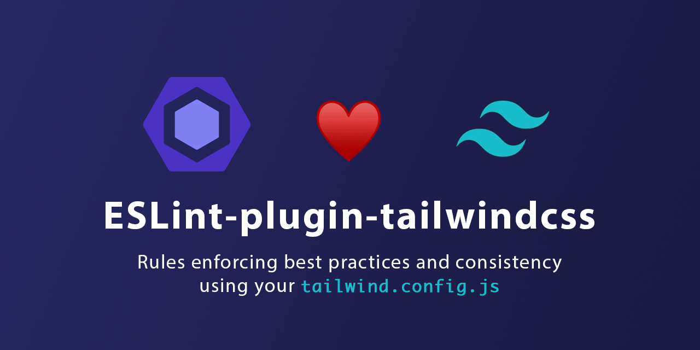

# eslint-plugin-tailwindcss



## Rules

<!-- begin auto-generated rules list -->

💼 Configurations enabled in.\
⚠️ Configurations set to warn in.\
✅ Set in the `recommended` configuration.\
🔧 Automatically fixable by the [`--fix` CLI option](https://eslint.org/docs/user-guide/command-line-interface#--fix).\
💡 Manually fixable by [editor suggestions](https://eslint.org/docs/latest/use/core-concepts#rule-suggestions).

| Name                                                                                   | Description                                                                         | 💼  | ⚠️  | 🔧  | 💡  |
| :------------------------------------------------------------------------------------- | :---------------------------------------------------------------------------------- | :-- | :-- | :-- | :-- |
| [classnames-order](docs/rules/classnames-order.md)                                     | Enforces a consistent order for the Tailwind CSS classnames, based on the compiler. |     | ✅  | 🔧  |     |
| [enforces-negative-arbitrary-values](docs/rules/enforces-negative-arbitrary-values.md) | Warns about `-` prefixed classnames using arbitrary values.                         |     | ✅  | 🔧  |     |
| [enforces-shorthand](docs/rules/enforces-shorthand.md)                                 | Avoid using multiple Tailwind CSS classnames when not required.                     |     | ✅  | 🔧  |     |
| [no-arbitrary-value](docs/rules/no-arbitrary-value.md)                                 | Forbid using arbitrary values in classnames.                                        |     |     |     |     |
| [no-contradicting-classname](docs/rules/no-contradicting-classname.md)                 | Avoid contradicting Tailwind CSS classnames.                                        | ✅  |     |     | 💡  |
| [no-custom-classname](docs/rules/no-custom-classname.md)                               | Detects classnames which do not belong to Tailwind CSS.                             |     | ✅  |     | 💡  |
| [no-unnecessary-arbitrary-value](docs/rules/no-unnecessary-arbitrary-value.md)         | Avoid unjustified arbitrary classnames.                                             |     | ✅  | 🔧  | 💡  |

<!-- end auto-generated rules list -->

## Settings

You should specify settings that will be shared across all the plugin rules. ([More about eslint shared settings](https://eslint.org/docs/latest/use/configure/configuration-files#configuring-shared-settings))

```js
// eslint.config.mjs
{
  settings: {
    tailwindcss: {
      // Attributes/props that could contain Tailwind CSS classes...
      // Optional, default values: ["class", "className", "ngClass", "@apply"]
      attributes: ["class"],
      // The absolute path pointing to you main Tailwind CSS v4 config file.
      // It must be a `.css` file (v4), not a `.js` file (v3)
      // REQUIRED, default value will not help
      cssConfigPath: dirname(fileURLToPath(import.meta.url)) + "/styles/tailwind.css",
      // Functions/tagFunctions that will be parsed by the plugin.
      // Optional, default values: ["classnames", "clsx", "ctl", "cva", "tv", "tw"]
      functions: ["twClasses"]
    },
  }
}
```

The default settings are exported via the [`DEFAULT_SETTINGS`](src/utils/parse-plugin-settings.ts).

## Made for Tailwind CSS v4

Version 4 of the `eslint-plugin-tailwindcss` is:

- re-written from scratch
- using TypeScript
- Based as much as possible on internal assets of Tailwind CSS:
  - via the [`prettier-plugin-tailwindcss` plugin](https://www.npmjs.com/package/prettier-plugin-tailwindcss)
  - via [`tailwind-api-utils`](https://github.com/hyoban/tailwind-api-utils)
- only compatible with:
  - Tailwind CSS v4.x.x
  - ESLint flat config format

## Status

This branch was started back in 2024, and I was quickly stuck while trying to use the internal mechanics of the `tailwindcss` package.

Simple tasks, like loading the CSS config, was impossible inside an ESLint plugin because ESLint plugins are synchronous by design while the tailwindcss package uses plenty of async functions.

😇 Hopefully, [hyoban](https://github.com/hyoban) made [`tailwind-api-utils`](https://github.com/hyoban/tailwind-api-utils) and [demonstrated in a PR](https://github.com/hyoban/eslint-plugin-tailwindcss/pull/3) how I could use it via [`synckit`](https://www.npmjs.com/package/synckit) 👏.

## Work in progress

This version is far from finished, yet it is available and open for contributions.

All the details are available in the [changelog](./CHANGELOG.md).

### Latest completed steps

- restore the automated tests running on the merge requests of the repo
- implement and test the usage of `tailwind-api-utils`
- read the settings from eslint (shared settings & rules settings)
- create the config utility
- implement the `classnames-order` rule and its tests
- implement the `no-custom-classname` rule and its tests

### Next steps

- implement the `enforces-negative-arbitrary-values` rule and its tests
- implement the `enforces-shorthand` rule and its tests
- implement the `no-arbitrary-value` rule and its tests
- implement the `no-contradicting-classname` rule and its tests
- implement the `no-unnecessary-arbitrary-value` rule and its tests

## Contributing

The project is open to all developers, you can [contribute the `eslint-plugin-tailwindcss`](CONTRIBUTING.md).

## 🤝 Support `eslint-plugin-tailwindcss`

| 🥰 How you can support us?                                                                                                                                                                                                            | 💪 They did it!                                                                                                                                                                                                                                                                                                                                                                                                                                                                                                                                                                                                                                                                                                                                                                                                                                                                                                                                                                                                                                                                                                                                                                                                                                                                                                                                                                                                                                                                                                                                                                                                                                                                                                                                                                                                                                                                                                                                                                                                                                                                                                                                                                                                                                                                                                                                                                                                                                                                                                                                                                                                                                                                |
| ------------------------------------------------------------------------------------------------------------------------------------------------------------------------------------------------------------------------------------- | ------------------------------------------------------------------------------------------------------------------------------------------------------------------------------------------------------------------------------------------------------------------------------------------------------------------------------------------------------------------------------------------------------------------------------------------------------------------------------------------------------------------------------------------------------------------------------------------------------------------------------------------------------------------------------------------------------------------------------------------------------------------------------------------------------------------------------------------------------------------------------------------------------------------------------------------------------------------------------------------------------------------------------------------------------------------------------------------------------------------------------------------------------------------------------------------------------------------------------------------------------------------------------------------------------------------------------------------------------------------------------------------------------------------------------------------------------------------------------------------------------------------------------------------------------------------------------------------------------------------------------------------------------------------------------------------------------------------------------------------------------------------------------------------------------------------------------------------------------------------------------------------------------------------------------------------------------------------------------------------------------------------------------------------------------------------------------------------------------------------------------------------------------------------------------------------------------------------------------------------------------------------------------------------------------------------------------------------------------------------------------------------------------------------------------------------------------------------------------------------------------------------------------------------------------------------------------------------------------------------------------------------------------------------------------ |
| **Premium Sponsors** <br /> Support us by becoming a sponsor. <br /> [Become a recurring sponsor](https://github.com/sponsors/francoismassart?frequency=recurring)                                                                    | <a href="https://www.sent.dm/" target="_blank"></a>                                                                                                                                                                                                                                                                                                                                                                                                                                                                                                                                                                                                                                                                                                                                                                                                                                                                                                                                                                                                                                                                                                                                                                                                                                                                                                                                                                                                                                                                                                                                                                                                                                                                                                                                                                                                                                                                                                                                                                                                                                                                                                                                                                                                                                                                                                                                                                                                                                                                                                                           |
| **Current Sponsors** <br /> Any amount is appreciated.                                                                                                                                                                                | <a href="https://github.com/codecov" target="_blank"></a> <a href="https://github.com/sourcegraph" target="_blank"></a> <a href="https://github.com/getsentry" target="_blank"></a>                                                                                                                                                                                                                                                                                                                                                                                                                                                                                                                                                                                                                                                                                                                                                                                                                                                                                                                                                                                                                                                                                                                                                                                                                                                                                                                                                                                                                                                                                                                                                                                                                                                                                                                                                                                                                                                                                                                                                                                                        |
| **Past sponsors** <br /> Even if this is just a one-time thing. <br /> [Become a backer](https://github.com/sponsors/francoismassart?frequency=one-time)                                                                              | <a href="https://github.com/acewf" target="_blank"></a> <a href="https://github.com/hyoban" target="_blank"></a> <a href="https://github.com/charkour" target="_blank"></a> <a href="https://github.com/aniravi24" target="_blank"></a> <a href="https://github.com/amotarao" target="_blank"></a> <a href="https://github.com/mongolyy" target="_blank"></a> <a href="https://github.com/t3dotgg" target="_blank"></a> <a href="https://github.com/fongandrew" target="_blank"></a> <a href="https://github.com/nivalis-studio" target="_blank"></a> <a href="https://github.com/jonz94" target="_blank"></a> <a href="https://github.com/dailydotdev/daily" target="_blank"></a> <a href="https://github.com/kylemh" target="_blank"></a> <a href="https://github.com/theMosaad" target="_blank"></a> |
| **Contributors** <br /> This project can evolve thanks to all the people who contribute. <br /> You are welcome to [contribute](CONTRIBUTING.md) to this project by reporting issues, feature requests or even opening Pull Requests. | <a href="https://github.com/francoismassart/eslint-plugin-tailwindcss/graphs/contributors"></a>                                                                                                                                                                                                                                                                                                                                                                                                                                                                                                                                                                                                                                                                                                                                                                                                                                                                                                                                                                                                                                                                                                                                                                                                                                                                                                                                                                                                                                                                                                                                                                                                                                                                                                                                                                                                                                                                                                                                                                                                                                                                                                                                                                                                                                                                                                                                                                                                                                                                    |
| **Supporters** <br /> Talk about the plugin on your social networks                                                                                                                                                                   | [Share the word on Bluesky](https://bsky.app/search?q=eslint-plugin-tailwindcss) or [Reach my profile](https://bsky.app/profile/francoismassart.be)                                                                                                                                                                                                                                                                                                                                                                                                                                                                                                                                                                                                                                                                                                                                                                                                                                                                                                                                                                                                                                                                                                                                                                                                                                                                                                                                                                                                                                                                                                                                                                                                                                                                                                                                                                                                                                                                                                                                                                                                                                                                                                                                                                                                                                                                                                                                                                                                                                                                                                                            |
