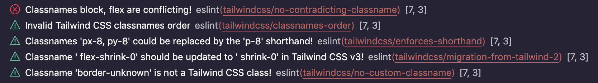

# eslint-plugin-tailwindcss

 


Rules enforcing best practices and consistency using [Tailwind CSS](https://tailwindcss.com/)

## **🎉 Version 3 is now ready for TailwindCSS v3 🎉**

## Make sure to use the correct version

- Still using TailwindCSS v2 ?
  - You should stick with `v1.x.x` or `v2.x.x` of this plugin (next support releases will be using major version `2`)
- Using TailwindCSS v3 ?
  - Make sure to use `v3.x.x` of this plugin

**If you are using the eslint extension, make sure to restart VSCode in order to use the lastest version of the plugin and not the former version from the cache.**

## We need you ❤️

Version 3 of the plugin is brand new and you will most likely experience bugs, please provide feedback by opening issues on GitHub with all the useful informations so that we can fix them all.

If you enjoy my work you can:

- [Share the plugin on Twitter](https://twitter.com/hashtag/eslint-plugin-tailwindcss)
- Contribute to the project by:
  - Giving feedback
  - Creating an issue
  - Make a pull request
  - Write a feature request
- Give back and [sponsor its development](https://github.com/sponsors/francoismassart)

## Latest changelog

- FIX: [correctly handle number values in config](https://github.com/francoismassart/eslint-plugin-tailwindcss/issues/86) (by [patrikholcak](https://github.com/patrikholcak) 🙏)

- FIX: [`transform-none` not allowed](https://github.com/francoismassart/eslint-plugin-tailwindcss/issues/84)

- FIX: [Important marker throws warning](https://github.com/francoismassart/eslint-plugin-tailwindcss/issues/82)
- FIX: [Boolean values in class throws error](https://github.com/francoismassart/eslint-plugin-tailwindcss/issues/83)
- FIX: [Negative margins](https://github.com/francoismassart/eslint-plugin-tailwindcss/issues/78)

- FIX: [Arbitrary values of color opacity](https://github.com/francoismassart/eslint-plugin-tailwindcss/issues/80)
- FIX: [Class transition-transform throws the wrong warning](https://github.com/francoismassart/eslint-plugin-tailwindcss/issues/77)

- New rule: [`migration-from-tailwind-2`](docs/rules/migration-from-tailwind-2.md) for easy migration from TailwindCSS `v2` to `v3`

- Support for TailwindCSS v3

  - New config matching the updated docs
  - Support for arbitrary properties

- `groupByResponsive` is enabled by default for `classnames-order`

[View all releases on github](https://github.com/francoismassart/eslint-plugin-tailwindcss/releases)

## Monthly sponsors

<a href="https://daily.dev/" target="_blank">
  
</a>

## One-time sponsors

[TheoBr](https://github.com/TheoBr) sponsorship gave me a little extra motivation. Thanks, man

## Supported Rules

Learn more about each supported rules by reading their documentation:

- [`classnames-order`](docs/rules/classnames-order.md): order classnames by target properties then by variants (`[size:][theme:][state:]`)
- [`migration-from-tailwind-2`](docs/rules/migration-from-tailwind-2.md) for easy upgrade from TailwindCSS `v2` to `v3`
- [`no-custom-classname`](docs/rules/no-custom-classname.md): only allow classnames from Tailwind CSS and the values from the `whitelist` option
- [`no-contradicting-classname`](docs/rules/no-contradicting-classname.md): e.g. avoid `p-2 p-3`, different Tailwind CSS classnames (`pt-2` & `pt-3`) but targeting the same property several times for the same variant.

Using ESLint extension for Visual Studio Code, you will get these messages


You can can the same information on your favorite command line software as well.

## Installation

You'll first need to install [ESLint](http://eslint.org):

```
$ npm i eslint --save-dev
```

Next, install `eslint-plugin-tailwindcss`:

```
$ npm i eslint-plugin-tailwindcss --save-dev
```

Add `tailwindcss` to the plugins section of your `.eslintrc` configuration file. You can omit the `eslint-plugin-` prefix:

```json
{
  "plugins": ["tailwindcss"]
}
```

## Configuration

Use our preset to get reasonable defaults:

```
  "extends": [
    "plugin:tailwindcss/recommended"
  ]
```

If you do not use a preset you will need to specify individual rules and add extra configuration:

Configure the rules you want to use under the rules section.

> The following lines are matching the configuration saved in the `recommended` preset...

```json
{
  "rules": {
    "tailwindcss/classnames-order": "warn",
    "tailwindcss/migration-from-tailwind-2": "warn",
    "tailwindcss/no-custom-classname": "warn",
    "tailwindcss/no-contradicting-classname": "error"
  }
}
```

Learn more about [Configuring Rules in ESLint](https://eslint.org/docs/user-guide/configuring/rules).

## Optional shared settings

Most rules shares the same settings, instead of duplicating some options...

You should also specify settings that will be shared across all the plugin rules.
[More about eslint shared settings](https://eslint.org/docs/user-guide/configuring#adding-shared-settings).

All these settings have nice default values that are explained in each rules' documentation. I'm listing them in the code below just to show them.

```json5
{
  "settings": {
    "tailwindcss": {
      // These are the default values but feel free to customize
      "callees": ["classnames", "clsx", "ctl"],
      "config": "tailwind.config.js",
      "cssFiles": ["**/*.css", "!**/node_modules"],
      "groupByResponsive": false,
      "groups": defaultGroups, // imported from groups.js
      "prependCustom": false,
      "removeDuplicates": true,
      "whitelist": []
    }
  }
}
```

The plugin will look for each setting value in this order and stop looking as soon as it finds the settings:

1. In the rule option argument (rule level)
2. In the shared settings (plugin level)
3. Default value of the requested setting (plugin level)...

## Upcoming Rules

- `enforces-shorthand`: Make sure you group properties inside a shorthand when possible e.g. `mx-5 my-5` should become `m-5`

- `validate-modifiers`: I don't know if possible, but I'd like to make sure all the modifiers prefixes of a classname are valid e.g. `yolo:bg-red` should throw an error...

- `no-redundant-variant`: e.g. avoid `mx-5 sm:mx-5`, no need to redefine `mx` in `sm:` variant as it uses the same value (`5`)

- `only-valid-arbitrary-values`:
  - e.g. avoid `top-[42]`, only `0` value can be unitless.
  - e.g. avoid `text-[rgba(10%,20%,30,50%)]`, can't mix `%` and `0-255`.

## Alternatives

I wrote this plugin after searching for existing tools which perform the same task but didn't satisfied my needs:

- [eslint-plugin-tailwind](https://www.npmjs.com/package/eslint-plugin-tailwind), not bad but no support (yet) for variants sorting
- [Headwind](https://marketplace.visualstudio.com/items?itemName=heybourn.headwind), only works within Visual Studio Code

## Contributing

You are welcome to contribute to this project by reporting issues, feature requests or even opening Pull Requests.

Learn more about [contributing to ESLint-plugin-TailwindCSS](CONTRIBUTING.md).
